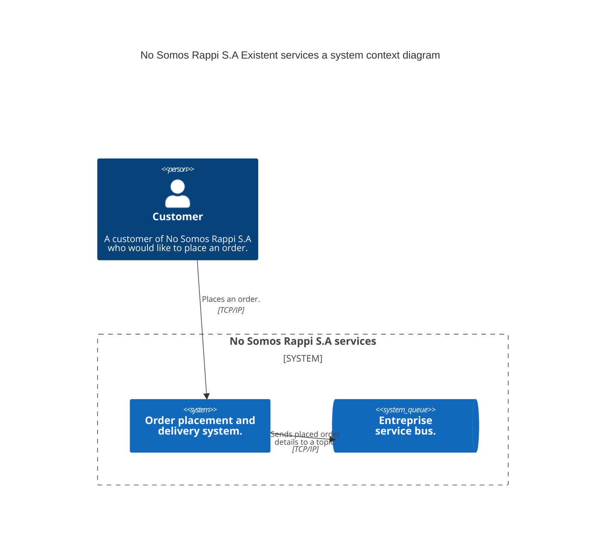
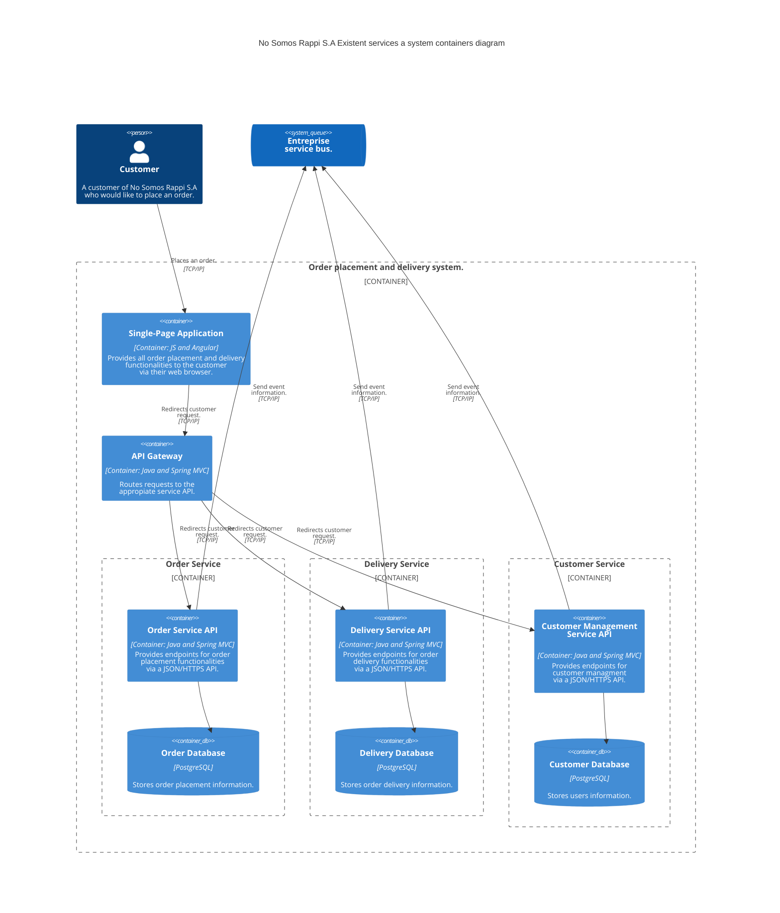

# Bootcamp Data Eng 20242 - Proyecto Final

## Propósito
El propósito del proyecto final descrito en este documento es que ustedes, como participantes, apliquen los temas y habilidades abordados en las clases del programa.

## Contexto
Son Ingenieros de Datos en No Somos Rappi S.A., una reputada compañía dedicada al envío de órdenes de comida a domicilio. Dicha compañía desea conocer algunos indicadores clave sobre el estado del negocio cada 30 segundos, 5 minutos y una hora. Estos indicadores son:

- **Tiempo promedio en procesar una orden**: cuánto tarda una orden en ser entregada al cliente que la solicitó una vez puesta en el sistema.
- **Top 10 de los productos más comprados** en cada intervalo de tiempo.
- **Top 10 de las tiendas que más han vendido productos** en cada intervalo de tiempo.
- **Top 5 de los clientes que más órdenes han generado** en el sistema por cada intervalo de tiempo.

Además, en No Somos Rappi S.A. se quiere conocer la precisión de las medidas reportadas en el día por parte del sistema de análisis en tiempo real. Esto, con el objetivo de poder conocer el % de precisión o confiabilidad del sistema en tiempo real.

En el siguiente enlace se puede encontrar el documento de visión de negocio elaborado por el Project Manager encargado de gestionar el proyecto: [Visión de negocio](https://github.com/scaleupseniors/dataEngineering001-20242/blob/main/proyectoFinal/ordersSystem/visionDeNegocio.md).

### Infraestructura existente
No Somos Rappi S.A. ya posee una infraestructura subyacente mostrada en las siguiente figuras.

A continuación, se muestra un diagrama de contenedores del sistema preexistente. Cabe recalcar que para este ejercicio solo tendremos en cuenta el servicio de órdenes.

## Lineamientos
Este proyecto consta de cuatro (4) fases:
1. Elaboración de una propuesta de arquitectura.
2. Despliegue de la propuesta de arquitectura.
3. Evaluación de la propuesta de arquitectura.
4. Publicación en Medium.

### Elaboración de una propuesta de arquitectura
Ustedes, como Ingenieros de Datos, deberán elaborar una propuesta de arquitectura y presentármela a mí, que para este trabajo cumpliré el rol de Arquitecto de Datos. Para la presentación de dicha propuesta se sugiere que elaboren los siguientes entregables:

- Diagrama de contexto del sistema (Modelo C4).
- Diagrama de contenedores del sistema (Modelo C4).
- Diagrama de despliegue del sistema (Modelo C4 o Google). 

Pueden hallar ejemplos de proyectos que tienen todos los diagramas mencionados [aquí](https://github.com/scaleupseniors/dataEngineering001-20242/tree/main/masSobreLasArquitecturasDeDatos/ejemplosDiagramasArquitectura).

- Documento: **Visión de atributos arquitectónicos**.

Yo, como Arquitecto de Datos, les pido que vayan más allá y analicen los _trade-offs_ (fortalezas y debilidades) de la arquitectura, escojan tres (3) atributos estructurales que su propuesta de arquitectura cumple muy bien y tres (3) de ellos que no cumple o que directamente empeore, justificando por qué cumple o no dicho atributo.

👉 Además, quiero que escojan una (1) métrica que permita medir (valga la redundancia) el estado de un atributo estructural en la arquitectura.

#### Mi consejo para ustedes para esta etapa
Tal como se ha descrito con anterioridad, para esta etapa se deberá de realizar un diagrama de despliegue de la arquitectura. Esto implica escoger las tecnologías a usar, ya sean de la nube o no. Les recomiendo que en LinkedIn busquen vacantes de ingenieros de datos en una empresa en la cual les gustaría trabajar, y seguidamente, vean qué tecnologías pide la misma. Determinen si dichas tecnologías pedidas sirven o no para su respectivo proyecto, argumentando si es o no una tecnología idónea o no para el mismo y por qué lo consideran así. 

### Despliegue de la propuesta de arquitectura
Luego de tener una arquitectura propuesta, pasaremos al despliegue de la misma en la nube de GCP. Allí se deberá crear toda la infraestructura necesaria para cumplir con los objetivos de negocio propuestos en el documento de visión de negocio y anteriormente mencionados.

### Evaluación de la propuesta de arquitectura
Una vez desplegada la infraestructura, quiero que evalúen si su propuesta fue o no acertada, teniendo en cuenta si realmente logra satisfacer de buena forma los atributos estructurales planteados desde un inicio, si la métrica implementada da resultados favorables y si se lograron cumplir los objetivos de negocio. Sean realistas, no pasa nada por equivocarse; yo mismo me he equivocado mil veces y continúo aprendiendo.

Además, quiero que especifiquen puntos fuertes y a mejorar de la arquitectura, así como cualquier decisión tomada que no resultó como lo esperaban.

### Publicación en Medium
Finalmente, resuman y describan todo lo hecho en el proyecto. Incluyan diagramas, cómo atacaron el problema, atributos arquitectónicos importantes y aquellos que empeoran o no cubre la arquitectura, problemas encontrados y suban a [Medium](https://medium.com/) esos hallazgos en forma de documento.

Por acá les dejo algunos artículos que me han gustado bastante:

- [Serverless Lambda Architecture with Google Cloud Platform](https://medium.com/@imrenagi/serverless-lambda-architecture-with-google-cloud-platform-35cb3123206b)
- [Calidad y Gobierno de Datos: El Talón de Aquiles de la Inteligencia Artificial](https://medium.com/@ivanamonuribe/calidad-y-gobierno-de-datos-el-tal%C3%B3n-de-aquiles-de-la-inteligencia-artificial-151e68b69bf7)
- [Lakehouse — The journey unifying Data Lake and Data Warehouse](https://medium.com/claimsforce/lakehouse-the-journey-unifying-data-lake-and-data-warehouse-bef7629c143a)
